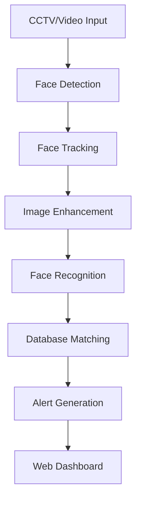

# Face Recognition System Architecture

## Overview
The system is designed as a modular, real-time face recognition pipeline with the following key components:



## Component Details

### 1. Video Processing Layer
- **Input Sources**: RTSP streams, IP cameras, video files
- **Frame Processing**: OpenCV-based pipeline with GPU acceleration
- **Key Features**:
  - Multi-stream handling
  - Adaptive frame sampling
  - Resolution scaling

### 2. AI Processing Layer
| Module            | Technology          | Functionality                     |
|-------------------|---------------------|-----------------------------------|
| Face Detection    | RetinaFace/MTCNN    | Locate faces in video frames      |
| Face Tracking     | DeepSORT            | Track faces across frames         |
| Face Enhancement  | GFPGAN/RealESRGAN   | Improve low-quality faces         |
| Face Recognition  | ArcFace/InsightFace | Generate facial embeddings        |

### 3. Data Layer
- **Database**: SQLite with AES-256 encryption
- **Storage Schema**:
  ```plaintext
  criminals
  ├── id (PK)
  ├── name
  ├── encrypted_embedding
  ├── hash_id
  ├── image_hash
  ├── metadata (JSON)
  └── created_at
  ```
- **Performance**: 100,000+ embeddings with sub-second query times

### 4. Alerting Layer
- **Notification Channels**:
  - Email (SMTP)
  - SMS (Twilio)
  - Webhooks (REST API)
- **Alert Content**:
  - Match details
  - Confidence score
  - Timestamp
  - Snapshot image

### 5. Web Interface
- **Frontend**: React.js with Tailwind CSS
- **Backend**: Flask with Socket.IO
- **Key Features**:
  - Real-time video display
  - Alert dashboard
  - Manual verification
  - System controls

## Performance Characteristics
| Metric               | Target Value        |
|----------------------|---------------------|
| Processing Speed     | 25-30 FPS (1080p)   |
| Recognition Accuracy | >95% @ 0.85 threshold|
| Latency              | <200ms per frame    |
| Scalability          | 4+ concurrent streams|

## Security Considerations
1. **Data Protection**:
   - Encrypted facial embeddings
   - Hashed image storage
   - Secure credential management

2. **Access Control**:
   - JWT authentication for API
   - Role-based dashboard access

3. **Compliance**:
   - GDPR-ready data handling
   - Right-to-be-forgotten implementation

## Scaling Options
1. **Vertical Scaling**:
   - GPU-accelerated instances
   - Model quantization

2. **Horizontal Scaling**:
   - Kubernetes deployment
   - Microservice architecture

3. **Edge Deployment**:
   - NVIDIA Jetson
   - Intel Movidius